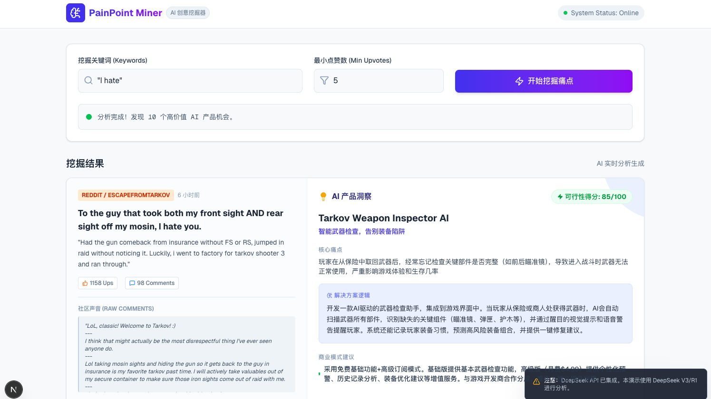

# IdeaPoint: Reddit 灵感挖掘与分析工具

> **"从 Reddit 的海量讨论中，通过 AI 筛选与分析，挖掘出高价值的产品灵感。"**

## 📖 项目简介 (Overview)

IdeaPoint 是一个专注于从 Reddit 论坛挖掘产品创意的辅助工具。我们把 Reddit 视为一座蕴含用户真实痛点和需求的“矿山”，通过自动化的流程来开采其中的价值。

本项目的核心逻辑非常直接：
1. **获取 (Fetch)**: 从 Reddit 搜索特定关键词的帖子。
2. **筛选 (Filter)**: 根据点赞数、评论数等指标，过滤掉低质量内容，只保留高热度、高讨论度的真实反馈。
3. **分析 (Analyze)**: 利用大语言模型 (LLM) 对筛选出的内容进行深度总结，提炼核心痛点，并自动构思潜在的 AI 产品解决方案。

## 🖼️ 界面预览 (Preview)



## ⚙️ 工作流程 (Workflow)

项目模拟了一个自动化的信息处理流水线：

### 1. 数据采集 (`api/search`)
- 直接对接 Reddit Search API。
- 支持自定义关键词（如 "I hate", "wish there was a app for" 等痛点词）。
- 获取帖子的标题、正文以及**高赞评论**，确保上下文完整。

### 2. 质量清洗
- 自动剔除 `[removed]` 和 `[deleted]` 的无效帖子。
- 设置点赞数阈值 (`minUps`)，确保只关注社区共鸣强烈的痛点。

### 3. 智能分析 (`api/analyze`)
- 调用 DeepSeek V3 API (`deepseek-chat`)。
- 扮演“产品分析师”角色，对每一条帖子进行结构化分析，输出：
  - 🎯 **核心痛点**: 用户到底在抱怨什么？
  - 💡 **产品方案**: 针对该痛点的 AI 产品构思。
  - 📊 **可行性评分**: 0-100 分的落地评估。
  - 💰 **商业模式**: 潜在的变现路径。

## 🛠️ 技术栈 (Tech Stack)

- **框架**: Next.js 16 (App Router)
- **语言**: TypeScript
- **UI**: React 19 + Tailwind CSS v4
- **AI 模型**: DeepSeek API (兼容 OpenAI SDK 格式)
- **网络请求**: Undici (配置了代理支持，确保国内环境可用)

## 🚀 快速开始 (Getting Started)

### 1. 安装依赖
```bash
npm install
# 或
yarn install
# 或
pnpm install
```

### 2. 配置环境
复制 `.env.example` 为 `.env.local`，并配置以下环境变量：
```env
# 必须配置，用于智能分析
DEEPSEEK_API_KEY=your_deepseek_api_key

# 可选配置，如果你在国内开发，可能需要配置代理
https_proxy=http://127.0.0.1:7890
```

### 3. 启动项目
```bash
npm run dev
```
访问 [http://localhost:3000](http://localhost:3000) 即可开始使用。

---

## 🌐 关注我

**我的网站**: [leigeai.com](https://leigeai.com)
